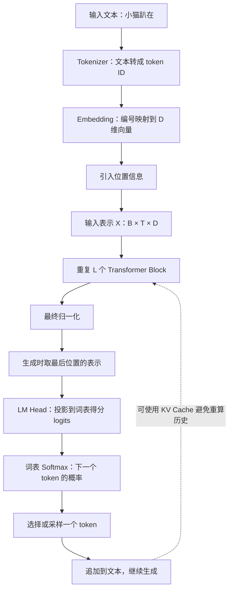
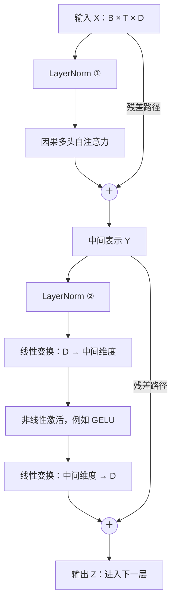
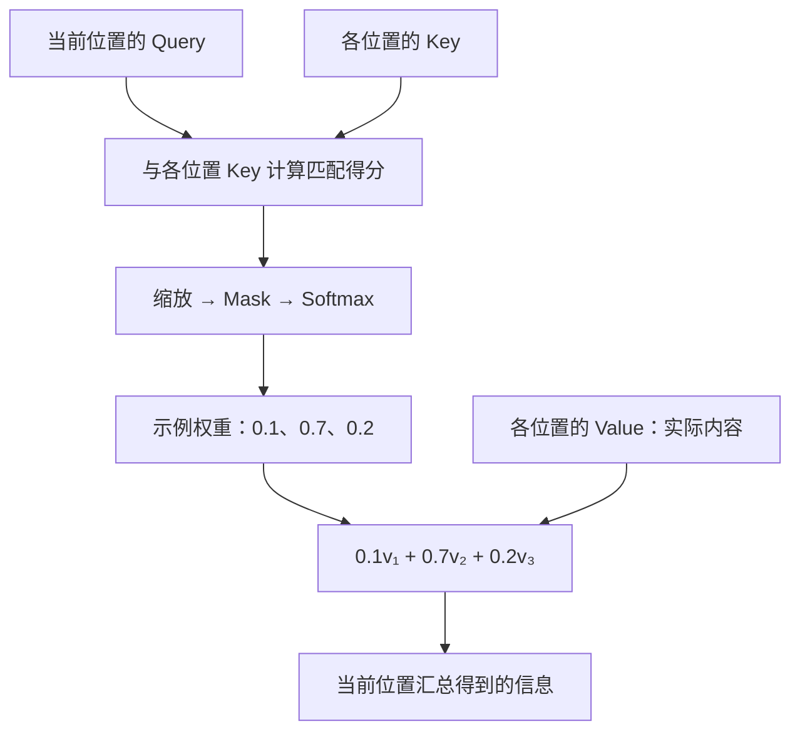
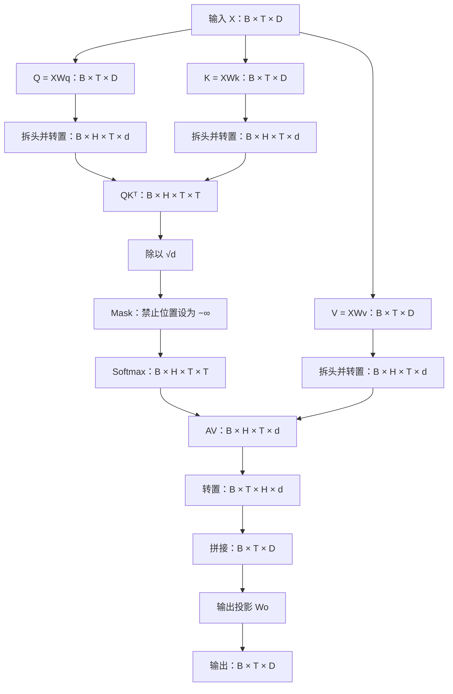
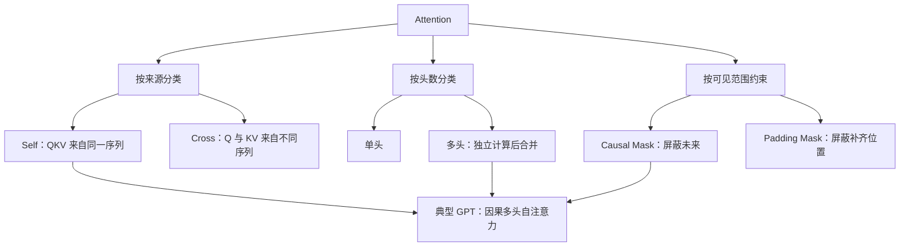
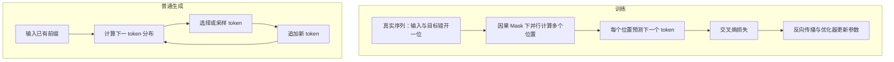
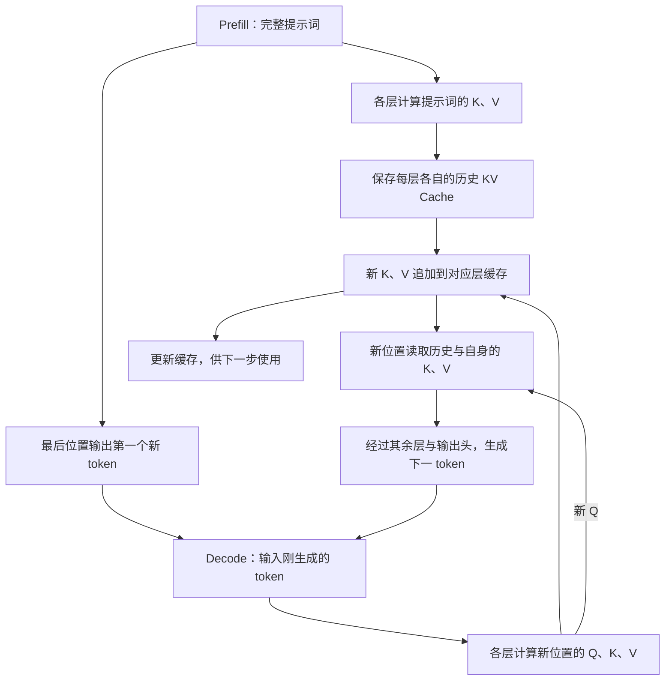
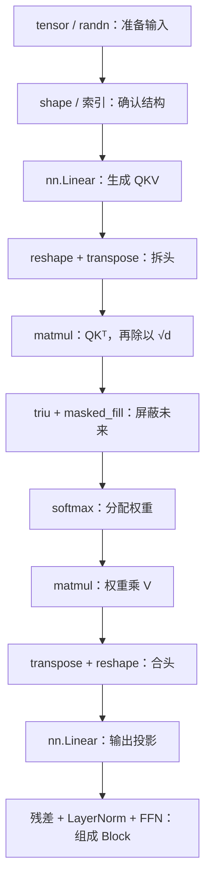

# Transformer 与多头注意力：原理与流程笔记

> 学习目标：理解 QKV、缩放点积注意力、多头注意力、Mask、位置机制、Transformer Block，以及训练和 KV Cache。重点是能解释计算原因、追踪张量形状，并独立实现基础注意力层。

## 1. 统一符号与阅读方式

本文把每个 token 放在矩阵的一行。序列长度记作 $T$，模型维度记作 $D$，批量大小记作 $B$，注意力头数记作 $H$。标准多头注意力通常取每头维度 $d=D/H$，因此要求 $D$ 能被 $H$ 整除。为了说明单个头的一般情况，也会使用 $d_k$ 表示 Q、K 的维度，使用 $d_v$ 表示 V 的维度。

单个序列的输入表示为 $X\in\mathbb{R}^{T\times D}$，加入批量维度后就是 $[B,T,D]$。矩阵里的每一行都是一个位置的表示，后续网络会不断更新这些表示，而不是改变 token ID 本身。

## 2. GPT 的任务：预测下一个 token

GPT 是自回归语言模型。它根据已有 token 序列，计算下一个 token 在整个词表上的概率分布，再通过选择或采样得到一个 token。将新 token 加入已有序列后，模型继续预测下一步，直到产生结束标记或达到生成限制。

token 不一定是完整单词或一个汉字，也可能是词的一部分、标点或其他文本片段。因此，示例中的“小猫”“趴在”等只是便于理解的文本片段，实际如何分词取决于具体 tokenizer。

条件概率可以写成：

$$
P(x_1,\ldots,x_T)=\prod_{t=1}^{T}P(x_t\mid x_1,\ldots,x_{t-1})
$$

这说明完整文本的概率可以分解为一系列下一个 token 的条件概率。生成完整回答时看起来是在写一大段文字，计算上却是逐步选择下一个 token。



## 3. Embedding：从编号到可计算的表示

token ID 只是词表索引，编号之间的距离没有直接的语义意义。Embedding 使用可训练矩阵为每个 token 提供一个向量表示。如果词表大小为 $|\mathcal V|$，嵌入矩阵通常为 $E\in\mathbb{R}^{|\mathcal V|\times D}$，查找第 $i$ 行便得到对应 token 的向量。

同一个 token 在初始查表时通常得到相同向量，但经过上下文处理后表示可以不同。例如，“苹果很好吃”和“苹果发布了手机”中的相关 token，会因为上下文不同而得到不同的隐藏表示。Transformer 的主要工作之一，就是逐层把初始表示变成与当前上下文有关的表示。

向量中的某些方向可能承载语义特征，但不能简单地说“第一维表示性别，第二维表示颜色”。实际信息通常分布在多个维度上，一个维度也可能参与表达多种特征。

## 4. 位置信息：模型如何区分词序

“小明追小红”和“小红追小明”中的词基本相同，顺序却改变了含义。纯粹不带位置机制和 Mask 的自注意力具有置换等变性：交换输入位置会相应交换输出，它本身不能直接表示具体词序。因此需要位置机制。

原始 Transformer 使用正弦、余弦位置编码，一些 GPT 类模型使用可学习的位置嵌入。这些方法可以把位置向量加到 token embedding 上。现代模型也常使用 RoPE，它通常在注意力内部对 Q、K 施加位置相关旋转，不是直接把位置向量加到 X 上。

RoPE 通过旋转向量的维度对，使 Q、K 的点积具有与相对位置有关的结构。当前阶段应先掌握它作用于 Q、K，以及它帮助注意力表示相对位置关系。因果 Mask 提供可见范围限制，但不能简单等同于完整的位置表示。

## 5. Transformer Block 的整体结构

一个常见的 GPT 类 Block 包含因果多头自注意力和前馈网络，并配合残差连接与归一化。注意力让不同位置交换信息；前馈网络对每个位置的表示进行非线性加工。同一层前馈网络在不同位置共享参数，但不会直接跨位置混合信息。

在 Pre-LN 结构中，可以写成：

$$
Y=X+\operatorname{MHA}(\operatorname{LN}(X))
$$

$$
Z=Y+\operatorname{FFN}(\operatorname{LN}(Y))
$$

残差路径让原表示能够直接传递，并与子层产生的更新相加，也有利于梯度传播。LayerNorm 通常沿每个 token 的特征维度计算归一化，并带有可训练的缩放和平移。它不等同于在整个 batch 上归一化。



这里展示的是常见 Pre-LN 示例。原始 Transformer 使用 Post-LN，部分现代模型使用 RMSNorm 和门控前馈网络。因此，理解基本职责比把所有模型都套成同一张结构图更重要。

## 6. Attention 的核心：匹配后加权汇总

Attention 可以理解为一次有选择的信息读取。每个 Query 与各个 Key 计算匹配得分，再把得分变成权重，用这些权重汇总对应的 Value。它通常不会只选择一个位置，而是让多个位置以不同权重贡献内容。

“关注”指的是数学上的加权操作，并不意味着模型具有人的意识。注意力权重可以帮助观察模型中的信息交互，但不能直接当作完整、可靠的因果解释。

## 7. Q、K、V 的来源与职责

对于自注意力，Q、K、V 来自同一个输入表示：

$$
Q=XW_Q,\qquad K=XW_K,\qquad V=XW_V
$$

Query 是用于查询的表示，Key 是用于参与匹配的表示，Value 是实际被读取的内容表示。可以概括为：Q、K 决定从哪里读、读多少，V 决定读取什么内容。

$W_Q$、$W_K$、$W_V$ 是通过训练学习的参数；Q、K、V 是当前输入计算出来的中间结果。普通推理时参数固定，但输入不同，中间结果就不同。同一头的投影参数在各个位置之间共享，并不是每个 token 单独拥有一套矩阵。

区分三组投影，使模型可以分别学习查询特征、匹配特征和内容表示。直接计算 $XX^T$ 也可以形成一种匹配，但会约束匹配方式。独立的 Q、K 投影允许模型学习更灵活且通常不对称的关系。

## 8. 缩放点积注意力：逐步拆解公式

完整公式为：

$$
\boxed{\operatorname{Attention}(Q,K,V)=\operatorname{softmax}\left(\frac{QK^T}{\sqrt{d_k}}+M\right)V}
$$

首先计算 $S=QK^T$。其中 $S_{ij}=q_i\cdot k_j$ 表示第 $i$ 个 Query 与第 $j$ 个 Key 的匹配得分。这种得分是模型学到的关系，不一定等同于日常意义上的语义相似度。

其次除以 $\sqrt{d_k}$。在各分量近似独立、均值为 0、方差为 1 的简化假设下，点积的方差约为 $d_k$，缩放后尺度更稳定。这样有助于缓解 softmax 因得分过大而过度饱和，避免梯度过小。这里是解释缩放动机的近似分析，并不是实际网络中始终严格成立的分布假设。

之后加入 Mask，再对每个 Query 对应的一行做 softmax。最后一维对应 Key 位置，所以代码中常使用 `softmax(dim=-1)`。得到的权重在允许位置上总和为 1；如果随后使用 attention dropout，被 dropout 修改后的权重则不一定仍逐行严格和为 1。

最后计算 $O=AV$。注意力权重 A 不是最终输出，最终输出是按权重汇总后的 Value。输出的位置数量由 Query 数量决定。

## 9. 单个 Query 的信息读取示例

假设一个 Query 对三个允许位置的注意力权重是 $[0.1,0.7,0.2]$，三个 Value 分别为 $v_1=[1,0]$、$v_2=[0,2]$、$v_3=[3,1]$，则输出为：

$$
o=0.1v_1+0.7v_2+0.2v_3=[0.7,1.6]
$$

这个例子把“匹配”和“内容”分开了。权重说明读取各个位置的比例，Value 说明实际汇总什么内容。示例权重是人为指定的教学数值，不是某个实际句子的实验结果。



## 10. 多头注意力：多种匹配方式并行计算

单个头会为每个 Query 形成一组注意力权重。多头使用多组投影参数，允许同一位置以不同方式匹配和读取信息。不同头可能学习局部依赖、较远位置关系或其他模式，但这种分工不是人工指定的，也不能保证每个头都有唯一而清楚的人类语义。

多头计算为：

$$
\operatorname{head}_r=\operatorname{Attention}(XW_Q^{(r)},XW_K^{(r)},XW_V^{(r)})
$$

$$
\operatorname{MHA}(X)=\operatorname{Concat}(\operatorname{head}_1,\ldots,\operatorname{head}_H)W_O
$$

标准实现通常取 $d=D/H$。如果模型维度为 8、使用 2 个头，每头通常输出 4 维，拼接恢复到 8 维，再经过输出投影 $W_O$ 混合各头结果。

每个头通常都能读取原输入的全部 D 个维度。代码中先执行大的投影，再拆分投影结果，这与分别使用各头投影是等价的组织方式。不能理解成“头一只看原始输入前半部分，头二只看后半部分”。

在总维度固定时，增加头数会减小每头维度，标准投影的总参数量通常不会因此成倍增加。多头的价值在于多种匹配方式，不是头数越多一定越好。

## 11. 多头注意力的完整张量流程

下面的图忽略可选 bias、dropout 等细节，集中展示标准 MHA 的维度。这里的 $d$ 是单头 Q、K、V 的共同维度。



例如 $B=2,T=4,D=8,H=2$，则输入为 $[2,4,8]$，拆头后的 QKV 为 $[2,2,4,4]$，得分为 $[2,2,4,4]$。这里序列长度和头维度恰好都是 4，但它们的意义不同。改变序列长度时，得分的最后两维都随之改变，头维度却不必变化。

## 12. Causal Mask：不能读取未来

GPT 中第 $i$ 个位置只允许读取自身及前面的输入位置。掩码在 softmax 之前加入：

$$
M_{ij}=\begin{cases}0,&j\le i\\-\infty,&j>i\end{cases}
$$

由于 $e^{-\infty}=0$，未来位置权重变为 0，允许位置的权重同时完成归一化。如果在 softmax 之后直接清零，剩余权重通常不再和为 1，除非额外重新归一化。

```text
                       Key / Value 位置
                        1   2   3   4
Query 位置 1            ✓   ×   ×   ×
Query 位置 2            ✓   ✓   ×   ×
Query 位置 3            ✓   ✓   ✓   ×
Query 位置 4            ✓   ✓   ✓   ✓

✓ 允许读取；× 禁止读取。
```

第 $i$ 个位置通常用于预测第 $i+1$ 个 token，所以读取自己并不算泄露目标。训练输入与目标通常错开一位，必须把这个关系与 Mask 一起理解。

Padding Mask 屏蔽补齐长度产生的无效位置，Causal Mask 屏蔽未来位置，两者可以同时使用。屏蔽 Padding Key 并不自动忽略 Padding 位置的训练损失，损失计算通常还需要单独排除无效目标。

## 13. Self-Attention、Cross-Attention 与多头的关系

Self-Attention 的 QKV 来自同一序列，权重形状通常为 $T\times T$。Cross-Attention 的 Q 来自序列 A，K、V 来自序列 B；若 A 长度为 N、B 长度为 M，权重为 $N\times M$，输出为 $N\times d_v$。

“自注意力或交叉注意力”是在讨论信息来源，“单头或多头”是在讨论并行投影的数量，“是否因果”是在讨论可见范围，三者不是互斥的分类。典型 GPT 使用因果多头自注意力。经典 Encoder-Decoder Transformer 中，解码器还通过 Cross-Attention 读取编码器输出；典型 GPT 没有这一编码器交叉注意力子层。



## 14. 输出层与两种 Softmax

经过多层 Block 和最终归一化之后，生成时使用最后位置的隐藏表示，经过词表投影得到 logits。若最后位置为 $h\in\mathbb{R}^{1\times D}$，输出矩阵为 $W_U\in\mathbb{R}^{D\times|\mathcal V|}$，则 $z=hW_U$ 给出词表上每个候选 token 的得分。

注意力 softmax 在位置维度上分配读取权重；输出 softmax 在词表维度上分配下一 token 的概率。它们都使用同一种数学运算，但对象和语义不同。

采用温度采样时，可使用 $p=\operatorname{softmax}(z/\tau)$，其中 $\tau>0$。较低温度通常使分布更集中，较高温度使其更平缓。Top-k 或 Top-p 进一步限制采样候选集合。模型输出分布之后究竟如何选 token，是解码策略的一部分。

## 15. 训练并行与生成逐步进行

训练时完整真实文本已经给出，可以同时计算多个位置的下一个 token 预测。Causal Mask 确保每个位置只能使用允许的前缀，这样即使整个序列被一次输入，也不会直接读取未来目标。

例如输入位置依次为“我、喜欢、小猫”，对应目标可以是“喜欢、小猫、后续 token”。这只是概念上的分词示例。训练通过交叉熵衡量预测分布与真实目标的差异，再通过反向传播和优化器更新参数。

生成时，未来 token 尚未确定，通常需要先生成当前 token，再把它作为下一步的输入。因此，训练可以并行计算多个位置，而普通自回归生成仍逐步进行。Speculative Decoding 等方法能够一次验证多个草稿 token，但不改变模型的自回归概率定义。



## 16. KV Cache：用显存减少重复计算

生成开始时，模型先处理完整提示词，这个阶段称为 Prefill。它在每一层保存该层已经计算出的 K、V，并利用最后位置输出生成第一个新 token。

后续 Decode 阶段，每一步输入刚生成的 token。在每一层，为新位置计算 Q、K、V，把新 K、V 加入该层缓存，再用新 Q 读取历史及自身的 K、V。旧位置的 Q 通常不参与新位置的查询，因此主要缓存 K、V。

在固定模型、因果可见范围和通常的位置设置下，历史位置不会因追加未来 token 而改变，所以这些缓存可以复用。每一层缓存各不相同，不能把第一层缓存当作其他层的缓存。



KV Cache 不代表新 token 不需要读取历史。历史越长，当前 Query 的读取工作仍可能越多。标准 MHA 中，每层 K、V 缓存都大致为 $[B,H,T,d]$，因此总缓存元素数量约为 $2LBTD$。实际显存还与数据类型、缓存管理和模型结构有关，GQA 等设计会减少 KV 头数。

## 17. 计算量与常见误解

标准全序列注意力的得分矩阵包含 $T^2$ 个位置关系，朴素实现需要显式保存这些关系。注意力矩阵乘法的计算量通常随序列长度呈二次增长；整个 Block 还包含线性投影和前馈网络的计算，不能把全部计算成本都归于注意力矩阵。

FlashAttention 通过分块等方式减少显存读写和中间矩阵存储，但并不是把标准稠密注意力的全部算术复杂度直接变成线性。KV Cache 主要服务于自回归推理，避免每一步重算历史，而不是消除所有长上下文成本。

多头不等于原始向量直接分块；自注意力不等于只看自己；注意力权重不等于词表概率；Decoder-only 不等于保留原始解码器的所有子层；位置机制也不一定是往 Embedding 上相加。把这些边界分清楚，面试时才不容易把简化比喻当成严格定义。

## 18. 手写代码时的检查方法

先令输入为 $[B,T,D]$，完成三次线性投影，然后 reshape 为 $[B,T,H,d]$ 并转置为 $[B,H,T,d]$。计算得分时只交换 K 的最后两个维度，使用 `K.transpose(-2, -1)`，不应同时倒置 batch 和头的维度。

得分除以单头维度的平方根，加入可以广播到得分形状的 Mask，再沿最后一维执行 softmax。注意不同框架接口对布尔 Mask 中 True 的含义可能不同，必须看具体 API；手写 `masked_fill` 时，自己明确 True 代表允许还是禁止。

注意避免让某个 Query 的所有位置都被设为负无穷，否则直接 softmax 可能产生 NaN。合头时先将 $[B,H,T,d]$ 转成 $[B,T,H,d]$，再使用合适的 reshape，必要时处理 contiguous，最后通过输出投影得到 $[B,T,D]$。

一个有意义的因果性检查是：改变序列后面某个 token，前面位置的输出应保持不变。在关闭 dropout 的确定性设置下，还可以对比一次完整前向传播与逐步使用 KV Cache 的结果，两者应在数值误差范围内一致。

## 19. 复习

一段文本先被 tokenizer 转成编号，Embedding 将编号映射为向量。模型通过位置机制感知顺序，并把这些表示送入多层 Transformer。每层注意力由输入产生 QKV，通过 QK 点积、缩放、Mask 和 softmax 得到位置权重，再用权重汇总 V。多个头并行计算后拼接并投影，结合残差与前馈网络更新表示。

最后位置的隐藏表示被投影到词表，形成下一个 token 的概率分布。训练时使用真实目标和交叉熵更新参数；普通推理时参数固定，逐步生成 token，并可使用各层 KV Cache 减少历史计算的重复。

## 20. 已学习与配套课程

[3Blue1Brown：GPT 是什么？直观解释 Transformer](https://www.bilibili.com/video/BV13z421U7cs) 用于建立整体直觉；[直观解释注意力机制](https://www.bilibili.com/video/BV1TZ421j7Ke) 用于理解 QKV 与信息汇总。

[李沐：64 注意力机制](https://www.bilibili.com/video/BV1264y1i7R1)、[67 自注意力](https://www.bilibili.com/video/BV19o4y1m7mo)、[68 Transformer](https://www.bilibili.com/video/BV1Kq4y1H7FL) 可用于补充公式、结构和实现。

[Karpathy：从零构建 GPT，合集 P7](https://www.bilibili.com/video/BV11yHXeuE9d?p=7) 可用于把理论转成 PyTorch 代码。本文是结合当前学习内容整理的笔记，并非视频逐字稿。

> 图表使用 Mermaid，公式使用 LaTeX。阅读软件需要启用 Mermaid 和数学公式渲染；不支持时仍可查看 Markdown 源码。

## 21. PyTorch 常用接口：从张量到模型

学习时先区分三类：`torch.xxx()` 是创建或计算张量的函数，`x.xxx()` 是对已有张量调用的方法，`torch.nn` 提供神经网络模块。此外，`shape`、`dtype`、`device` 等是属性，读取时不加括号。

理解新接口时，可以问三个问题：它是否改变数据内容？是否改变张量形状？是否包含可以训练的参数？例如 reshape 主要改变组织形式，softmax 改变数值，Linear 则使用可训练参数变换特征。

### 21.1 创建张量：准备输入与辅助数据

`torch.tensor()` 将已有数据转换成张量；`torch.randn()` 从标准正态分布生成随机数；`torch.rand()` 从 `[0,1)` 的均匀分布生成随机数。标准正态分布的理论均值为 0、标准差为 1，但一次生成的少量数值不保证平均值恰好为 0。

| 接口                 | 用途                                         | 示例                             |
| -------------------- | -------------------------------------------- | -------------------------------- |
| `torch.tensor()`     | 从已有数据创建张量                           | `torch.tensor([[1, 2], [3, 4]])` |
| `torch.randn()`      | 标准正态随机数                               | `torch.randn(2, 4, 8)`           |
| `torch.rand()`       | `[0,1)` 均匀随机数                           | `torch.rand(2, 4)`               |
| `torch.zeros()`      | 全 0 张量                                    | `torch.zeros(4, 4)`              |
| `torch.ones()`       | 全 1 张量                                    | `torch.ones(4, 4)`               |
| `torch.arange()`     | 等间隔序列，默认步长为 1                     | `torch.arange(4)`                |
| `torch.randn_like()` | 沿用另一张量的形状、类型和设备生成正态随机数 | `torch.randn_like(x)`            |
| `torch.zeros_like()` | 沿用另一张量的形状、类型和设备创建全 0 数据  | `torch.zeros_like(x)`            |

```python
import torch
from torch import nn

torch.manual_seed(42)
x = torch.randn(2, 4, 8)
positions = torch.arange(4)  # tensor([0, 1, 2, 3])
token_ids = torch.tensor([[0, 1, 2, 3]], dtype=torch.long)
```

`randn(2,4,8)` 创建三维张量，共有 64 个数。在我们的练习中，三个轴分别解释为两条序列、每条四个 token、每个 token 八维。PyTorch 本身不知道这些轴的语义，是模型设计赋予它们含义。

`manual_seed(42)` 设置随机数生成器的起点，便于在相同环境与调用顺序下复现实验。它不代表后续每次调用 randn 都得到相同结果，生成器状态会随调用推进；它也不是跨所有设备、版本和算法的绝对确定性保证。

### 21.2 查看张量与索引

| 属性或方法    | 含义                                   |
| ------------- | -------------------------------------- |
| `x.shape`     | 各轴的大小                             |
| `x.ndim`      | 轴的数量                               |
| `x.numel()`   | 元素总数                               |
| `x.dtype`     | 数据类型                               |
| `x.device`    | 所在设备                               |
| `x.size(dim)` | 指定轴的大小                           |
| `x.item()`    | 将只有一个元素的张量转换为 Python 数值 |

对于 `[2,4,8]` 的 x，`x.ndim` 为 3，`x.numel()` 为 64，`x.size(-1)` 为 8。这里“张量有三个轴”与“每个 token 是八维向量”是两个不同概念。

索引从 0 开始。`x[0]` 选择第一条序列，形状为 `[4,8]`；`x[0,0]` 选择该序列第一个 token，形状为 `[8]`；`x[0,0,0]` 选择一个分量，得到标量张量。`x[1,2]` 选择第二条序列的第三个 token。

`x[:, -1, :]` 表示所有序列的最后一个 token 的全部分量；`x[:, :-1, :]` 表示所有序列中除最后位置之外的部分。整数索引通常移除相应轴，切片则保留该轴。例如 `x[:, -1:, :]` 形状为 `[B,1,D]`，而 `x[:, -1, :]` 为 `[B,D]`。

### 21.3 调整形状与轴顺序

| 方法           | 用途                               | 示例                     |
| -------------- | ---------------------------------- | ------------------------ |
| `reshape()`    | 在元素总数不变的前提下重新组织形状 | `x.reshape(2, 4, 2, 4)`  |
| `view()`       | 在内存步长兼容时返回另一形状的视图 | `x.view(2, 4, 2, 4)`     |
| `transpose()`  | 交换两个轴                         | `x.transpose(1, 2)`      |
| `permute()`    | 指定全部轴的新顺序                 | `q.permute(0, 2, 1, 3)`  |
| `unsqueeze()`  | 插入一个大小为 1 的轴              | `x.unsqueeze(0)`         |
| `squeeze()`    | 移除大小为 1 的轴                  | `x.squeeze(0)`           |
| `flatten()`    | 合并连续的一段轴                   | `x.flatten(start_dim=1)` |
| `contiguous()` | 必要时转换为连续内存布局           | `x.contiguous()`         |

reshape 改变元素的分组方式，transpose 改变轴的排列关系，二者不能随意替代。多头注意力先将 D 分组为 H 和 d，再交换 H 与 T：

```python
B, T, D = x.shape
H = 2
d = D // H
q = nn.Linear(D, D, bias=False)(x)
q = q.reshape(B, T, H, d).transpose(1, 2)
# [B,T,D] → [B,T,H,d] → [B,H,T,d]
```

view 不会为不兼容的布局自动复制数据，转置之后直接调用可能报错。reshape 在可能时返回视图，必要时会复制。contiguous 则在当前布局不满足要求时创建连续布局的数据。不要把 reshape 当成永远不复制数据的操作。

`squeeze()` 不指定轴时会去掉所有大小为 1 的轴，如果 batch size 恰好为 1，可能意外去掉 batch 轴。需要保留明确结构时，优先指定要移除的轴。

### 21.4 数学计算、聚合与 Softmax

| 接口或运算                    | 用途                     |
| ----------------------------- | ------------------------ |
| `x + y`                       | 对应元素相加，可用于残差 |
| `x * y`                       | 对应元素相乘             |
| `x @ y`、`torch.matmul(x, y)` | 矩阵乘法，支持批量矩阵   |
| `x.sum(dim=...)`              | 沿指定轴求和             |
| `x.mean(dim=...)`             | 求平均值                 |
| `x.var(dim=...)`              | 求方差                   |
| `x.sqrt()`                    | 开平方                   |
| `x.abs()`                     | 取绝对值                 |
| `x.max()`                     | 返回全局最大值           |
| `torch.softmax(x, dim=...)`   | 沿指定轴归一化为权重     |
| `torch.argmax(x, dim=...)`    | 返回最大值的索引         |

`*` 与 `@` 不同。两个向量先对应相乘再求和，可计算点积；矩阵乘法则一次完成所有行列的点积。在注意力中，前面的 batch、头维度作为批量维度，最后两个维度执行矩阵乘法。

```python
# query、key 是两个一维向量
manual_score = (query * key).sum()

# q、k 的形状是 [B,H,T,d]
scores = q @ k.transpose(-2, -1)
scores = scores / (d ** 0.5)
```

dim 指定沿哪个轴计算。对于 `[B,H,T,T]` 的得分，最后一维是 Key 位置，所以 softmax 使用 `dim=-1`。聚合操作默认通常移除所选轴，使用 `keepdim=True` 可以保留大小为 1 的轴，方便后续广播。

```python
row_mean = scores.mean(dim=-1, keepdim=True)
# [B,H,T,T] → [B,H,T,1]
```

手写 LayerNorm 方差时需要注意：现代 PyTorch 的 `torch.var` 默认使用 `correction=1`，而 LayerNorm 使用相当于 `correction=0` 的方差估计。为对齐 LayerNorm，可写 `x.var(dim=-1, correction=0, keepdim=True)`，避免因默认设置不同而得到不一致结果。

### 21.5 Mask、条件选择与拼接

| 接口                           | 用途                          |
| ------------------------------ | ----------------------------- |
| `torch.triu()`                 | 保留上三角区域                |
| `torch.tril()`                 | 保留下三角区域                |
| `x.masked_fill(mask, value)`   | Mask 为 True 的位置填入指定值 |
| `torch.where(condition, a, b)` | 条件为 True 取 a，否则取 b    |
| `torch.cat()`                  | 沿已有轴拼接                  |
| `torch.stack()`                | 新增一个轴后堆叠              |

因果 Mask 使用上三角区域表示禁止读取的未来位置。`diagonal=1` 从主对角线上方开始，因此不屏蔽自身。一个 `[T,T]` 的 Mask 可以广播到 `[B,H,T,T]`，让所有序列和头使用相同的可见关系。

```python
mask = torch.triu(
    torch.ones(T, T, dtype=torch.bool, device=scores.device),
    diagonal=1
)
masked_scores = scores.masked_fill(mask, float("-inf"))
weights = torch.softmax(masked_scores, dim=-1)
```

广播允许某些不同形状参与运算：从末尾逐轴比较，维度相等或其中之一为 1 时通常可以广播，缺少的前导轴视为 1。广播不等于两种形状可以随意相加，使用前应明确每个轴的含义。

cat 沿已有轴连接，stack 新建一个轴。假设 a、b 都是 `[2,3]`，则 `torch.cat([a,b], dim=0)` 为 `[4,3]`，`torch.stack([a,b], dim=0)` 为 `[2,2,3]`。cat 要求除拼接轴之外的维度匹配，stack 要求各输入形状相同。

### 21.6 神经网络模块

| `torch.nn` 接口         | 用途                         |
| ----------------------- | ---------------------------- |
| `nn.Module`             | 自定义神经网络的基础类       |
| `nn.Linear`             | 可训练线性变换               |
| `nn.Embedding`          | 整数索引查表获得向量         |
| `nn.LayerNorm`          | 对指定的末尾维度归一化       |
| `nn.GELU`、`nn.ReLU`    | 非线性激活                   |
| `nn.Dropout`            | 训练时随机置零并缩放部分元素 |
| `nn.Sequential`         | 自动按顺序调用模块           |
| `nn.ModuleList`         | 保存并注册一组模块           |
| `nn.MultiheadAttention` | 已封装的多头注意力           |
| `nn.CrossEntropyLoss`   | 分类和语言模型常用损失       |

Linear 只变换最后一个轴。例如 `nn.Linear(8,32)` 将 `[B,T,8]` 变成 `[B,T,32]`。PyTorch 中权重存储形状为 `[out_features,in_features]`，计算为 `x @ weight.T + bias`。前后两个参数是输入、输出特征维度，不是序列长度和头数。

Embedding 接收整数索引。`nn.Embedding(6,8)` 创建六行八列的可训练表，将 `[B,T]` 的 token ID 转成 `[B,T,8]`。LayerNorm(D) 则分别对每个位置的最后 D 个分量归一化，不直接混合不同 token。

```python
self.ffn = nn.Sequential(
    nn.Linear(D, 4 * D),
    nn.GELU(),
    nn.Linear(4 * D, D)
)
```

Sequential 适合前一个输出直接交给后一个输入的流程。ModuleList 负责注册子模块，具体怎样调用由 forward 决定。我们的 Block 返回 `(output, weights)`，堆叠时可以用 ModuleList，自己在循环中取出 output 继续传递。

```python
# __init__ 中
self.blocks = nn.ModuleList([
    TransformerBlock(model_dim, num_heads)
    for _ in range(num_layers)
])

# forward 中
for block in self.blocks:
    x, weights = block(x)
```

封装类时使用 `super().__init__()` 初始化 Module，并在 `__init__` 中创建可训练层，在 forward 中复用。通常调用 `model(x)`，由 Module 的调用机制执行 forward。不要每次 forward 都重新创建随机初始化的线性层。

### 21.7 自动求导与训练流程

| 接口                    | 用途                 |
| ----------------------- | -------------------- |
| `loss.backward()`       | 反向传播计算梯度     |
| `parameter.grad`        | 查看参数梯度         |
| `model.parameters()`    | 遍历模型参数         |
| `torch.optim.AdamW()`   | 创建 AdamW 优化器    |
| `optimizer.zero_grad()` | 清理梯度             |
| `optimizer.step()`      | 根据梯度更新参数     |
| `torch.no_grad()`       | 暂时关闭梯度记录     |
| `x.detach()`            | 从当前计算图分离张量 |
| `model.train()`         | 设置训练模式         |
| `model.eval()`          | 设置评估模式         |

PyTorch 的梯度默认累积，普通训练通常每一步先清理梯度，再前向计算损失、反向传播、更新参数。backward 只计算梯度，真正改变参数的是 optimizer.step。

```python
# 假设 model 返回分类 logits，targets 是类别整数索引
optimizer = torch.optim.AdamW(model.parameters(), lr=1e-3)
loss_fn = nn.CrossEntropyLoss()

model.train()
optimizer.zero_grad(set_to_none=True)
logits = model(inputs)
loss = loss_fn(logits, targets)
loss.backward()
optimizer.step()
```

这段展示的是训练结构，不是直接对当前返回 `(output, weights)` 的注意力模块训练。语言模型还需要词表输出头，以及错开一位的训练目标。若 logits 是 `[B,T,V]`，可展开为 `[B*T,V]`，目标展开为 `[B*T]` 后计算交叉熵。`CrossEntropyLoss` 接收原始 logits，不应先手动 softmax。

eval 不会自动关闭梯度记录，no_grad 也不会自动设置评估模式。评估时经常同时使用 `model.eval()` 和 `with torch.no_grad():`。当前手写模块没有 dropout，但后续加入相关层时，这一区别会影响结果。

### 21.8 复制、验证与梯度关系

`x.clone()` 复制数据，但仍可以保留与原张量的梯度关系。`x.detach()` 切断梯度关系，但通常共享底层数据存储。如果需要既独立存储又脱离计算图，可以使用 `x.detach().clone()`。`x_changed = x` 仅让两个变量引用同一张量，不是独立复制。

`torch.allclose(a,b)` 判断两张量是否在给定浮点误差内接近，而不是要求逐位完全相同。它适合检查手工点积与矩阵乘法结果，以及因果性验证。`(a-b).abs().max().item()` 用于输出最大绝对差异。

```python
model.eval()
x_changed = x.clone()
x_changed[:, -1, :] = torch.randn_like(x_changed[:, -1, :])

with torch.no_grad():
    original, _ = model(x)
    changed, _ = model(x_changed)

assert torch.allclose(
    original[:, :-1, :], changed[:, :-1, :],
    atol=1e-6, rtol=1e-5
)
```

这里必须使用同一个模型比较，不能在两次计算之间重新初始化参数。检查通过说明在这一输入和设置下，没有观察到未来位置影响前面输出；更完整的验证可以覆盖不同长度和不同被修改位置。

### 21.9 设备、类型与保存模型

`x.to(device)` 返回指定设备上的张量，应使用 `x = x.to(device)` 接收结果。`model.to(device)` 将模块参数和缓冲区移动到对应设备。模型、输入与辅助 Mask 必须位于兼容设备，创建 Mask 时使用 `device=x.device` 可以避免硬编码 CPU。

```python
device = torch.device("cuda" if torch.cuda.is_available() else "cpu")
model = model.to(device)
x = x.to(device)
```

`model.state_dict()` 包含参数和持久缓冲区。通常保存 state_dict，而不是把整个模型对象直接序列化。恢复时先用匹配的结构创建模型，再加载状态。

```python
torch.save(model.state_dict(), "attention_weights.pt")

# restored_model 需要先按相同配置创建
state = torch.load(
    "attention_weights.pt",
    map_location="cpu",
    weights_only=True
)
restored_model.load_state_dict(state)
restored_model.eval()
```

保存权重不会自动保存完整的模型设计与训练配置，模型维度、头数和层数等需要一并记录。继续训练时还通常需要保存优化器状态和训练进度。

### 21.10 当前阶段的记忆主线

先用 tensor 或 randn 准备输入，通过 shape 和索引理解结构，用 Linear 生成 QKV。接着使用 reshape 和 transpose 拆头，用矩阵乘法计算位置关系，通过 triu 和 masked_fill 限制可见范围，用 softmax 分配权重，再乘 V 汇总内容。最后调整轴顺序、合头和输出投影，外层加入残差、LayerNorm 和 FFN。


